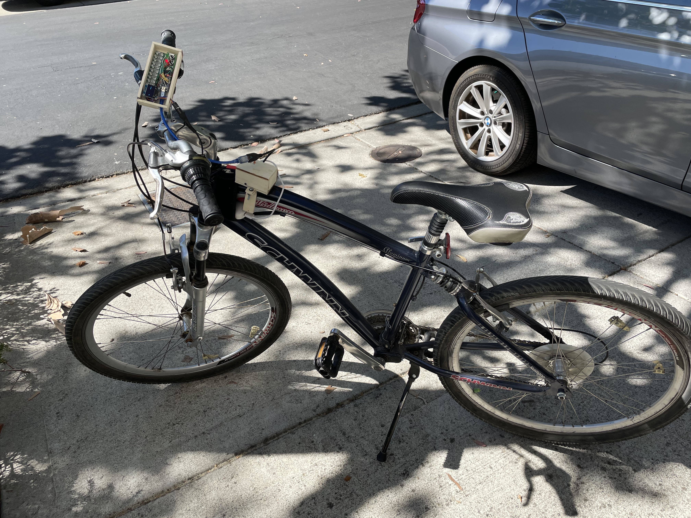
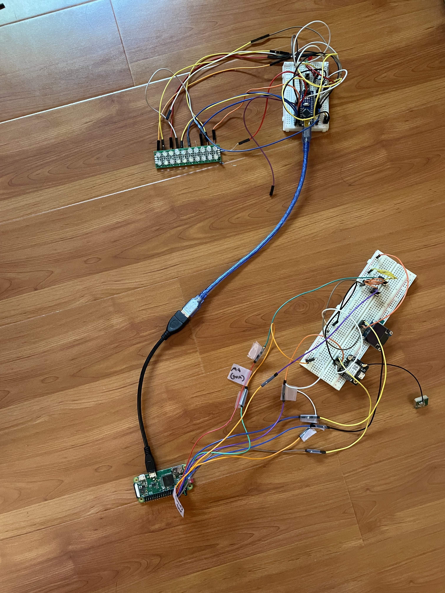

# BikeDashboardPlus

- The make-yourself page is [here](docs/pages/make_yourself.md).  
- [How to use your Bike Dashboard](docs/pages/usage.md)

  

## Description

Over my spring break in April 2021, I made a "Bike Dashboard" ([Project description](https://create.arduino.cc/projecthub/jonathanhliu21/a-dashboard-for-a-bike-unfinished-6dc0cb), [Github Repo](https://github.com/jonyboi396825/BikeDashboard)) using an Arduino Nano, an LCD screen, and a GPS. I made this to make finding out the time while riding a bike safer, and I wanted a safe way to track the route that I biked. I thought that pulling over my bike to check my phone for the time was inconvenient, and checking my phone while biking was dangerous. I was also interested in viewing the speed while biking.

However, That design had many problems. I could not put that many features on it because the Nano did not have much memory. The speed on the LCD updated very slowly. The LCD screen was also very big and captured attention, which may have gotten my bike stolen. Lastly, even though it could track, I had no way of viewing it on a map. Because of these problems, I wanted a new design.

<figure>
    
    <figcaption>BikeDashboardPlus in development. The breadboard and Raspberry Pi on the bottom would be the central piece, and the breadboard on the top would be the handle piece.</figcaption>
</figure>

## How it works

This new Bike Dashboard features a Raspberry Pi that gets the data from the GPS and puts it onto an OLED. It is connected to the Arduino via USB, and the Arduino controls the buttons for route tracking (start/stop/pause tracking), and a 2x20 LED panel that can currently only display speed by lighting up a certain LED that corresponds to a number.

The OLED displays speed, date and time, how well the GPS is connected (No fix, 2D fix, or 3D fix), and the state of tracking (tracking, paused, or not tracking). 

Additionally, there is another mode called "server mode," where the Raspberry Pi runs a local website. On the website, the user can customize units, time zone, and other features. They can also view their tracked routes on a map. Lastly, if the GPS disconnected or stopped tracking while biking and the user had to restart the tracking, they can combine those two track files into one.

With the Raspberry Pi, I solved the low memory problem and the slowness issue. I was able to get the GPS data in a separate thread so it wouldn't block the program. I tried to make it inconspicuous by using a small OLED and LED panel, but my design still makes the bike capture a lot of attention.

To get a more in-depth understanding of how it works, go [here](docs/pages/usage.md).

## Problems I ran into 

These are some major problems I ran into while working on this project.

| Problem               | How I solved it                |
|-----------------------|--------------------------------|
| The LED matrix couldn't light up 2 LEDs at once because I wired the circuit wrong. I originally wanted *n* LEDs to light up if I was going at speed *n*. | Instead of resoldering the entire LED matrix, which would have taken a long time, I changed the feature so that only one LED would light up at a time, and that LED would correspond to a certain speed. |
| The light on the LED matrix would be very dim when it lit up. | This was caused by my code not checking if any LEDs in that row were being used, therefore lighting up 2 LEDs back and forth in quick succession, making the LED seem dim. I added an `if` statement that would check if any LEDs were on in that row and turn them off before turning the current one on. |
OSError on OLED: Because I was writing data to the OLED too quickly, after a few minutes, the program would raise an OSError and stop because the data would not be written successfully to the OLED. | I tried experimenting with the amount of delay between writing data to the OLED and seeing how long it would last before raising an OSError. However, I realized I can catch the error and let the user re-begin the OLED, which was a much more reliable solution. |
| The GPS on the bike would take 5 minutes to connect, which was too slow. | I glued the antenna position of the GPS to the top of the central piece instead of the side, so it is pointed directly to the sky. It now takes 1 minute to connect.

Other problems:
- I accidentally soldered the purple LEDs with the white ones on the LED panel because they looked similar (they were both clear).
- For the case, I bought wood too hard to be cut by a knife, so I had to use a saw instead, and it did not cut the wood perfectly. This made it very hard to assemble the case and glue everything together. Thanks to my dad for helping me cut the wood and designing the case and mount.

## Problems that still occur

The bugs are listed below. I will try my best to fix most of them, delete them from this list, and create a new bug-fixing release each time I do so. However, some may take longer than others to fix.

- The track files are in UTC rather than the local time zone
- The shutdown button can be easily pressed so I sometimes accidentally shut down my RPi even when I don't mean to.

### Done
- None yet

## Upgrade ideas

I will try to implement these enhancements as long as they are not a major change (e.g. a complete rewrite in code, a complete redesign of the mounts and case, needing different parts, or a change in the schematics), or they are not too time-consuming to implement, as I have a very busy schedule. I may not have time to implement all of them. They will be released as features in a minor release.

### Next minor release
- Allow users to separate tracking files after combining them
- If the user chooses to update from the website, then automatically pull from the repository

### Later minor releases
- Track the distance along with coordinates instead of calculating the distance after
- Make the LED panel show more than just speed
- Make a more intuitive configuration page
- Put the Pi in "sleep" mode or alter the OS such that it will boot faster (takes ~2min currently)
- Track speed and time in addition to distance and location

### Next major release
- Remake BOM to include smaller parts and redesign model so everything will be in one small piece attached to the bike

### Done 
- Continue tracking even if disconnected

## Making this project yourself

If you have a Raspberry Pi and a bike, and you are interested in making this project yourself with your Raspberry Pi, then [go here](docs/pages/make_yourself.md).
