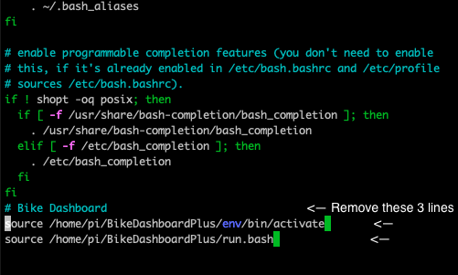

# Making this project yourself
[Back to README](/README.md)

## Parts needed

## Schematic


## 3D Printing

## Installation
1. If you haven't installed the Raspberry Pi OS, follow the instructions below. Make sure to install "Raspberry Pi OS (32 bit)" and not any other OS as they might not come with Python or cURL.
- [Setting up the Raspberry Pi](https://projects.raspberrypi.org/en/projects/raspberry-pi-setting-up)
- [Setting up the Raspberry Pi headless](https://www.raspberrypi.org/documentation/configuration/wireless/headless.md)

- [Python installation if you do not have it installed](https://projects.raspberrypi.org/en/projects/generic-python-install-python3)

- Curl installation if you do not have it installed:
  ```
  sudo apt update
  sudo apt install curl
  ```

2. To install BikeDashboard Plus: 
    ```
    curl -s https://raw.githubusercontent.com/jonyboi396825/BikeDashboardPlus/master/install.bash -o install.bash && bash install.bash 
    ```

    **This will edit ~/.bashrc, running the program whenever you start bash, so if you start the terminal, make sure to type ^C (control-C, keyboardInterrupt) to exit out of the program.**

3. Make a backup of /etc/rc.local: `cp /etc/rc.local /etc/rc_backup.local`
4. Edit /etc/rc.local
- Type `sudo nano /etc/rc.local`
- Scroll down. Type in `bash &` on the line that is before `exit 0`. **Make sure you type it before** `exit 0` **, and you type in the ampersand (&) or the Pi will not boot.**
- Save and exit: Press ^X (Control-X), and then Y.


5. Reboot the Pi: `sudo reboot`

From now on, the program should immediately run whenever you turn on and boot up your Raspberry Pi.

## Disabling 
This prevents the program from running whenever you start up your terminal on your Raspberry Pi.

1. Run this command: `nano ~/.bashrc`
2. Scroll down and remove the following lines from ~/.bashrc.
```bash
# Bike Dashboard 
source /path/to/BikeDashboardPlus/run.bash
```



3. Press ^X (Control-X), then Y to save and exit.
4. Reboot the Pi: `sudo reboot`
    
## Uninstalling

1. Disable the program (See "Disabling")
2. Remove the `bash` command from /etc/rc.local by typing in `sudo nano /etc/rc.local`
3. Delete the `bash &` line you wrote when installing.
4. Save and exit (Press ^X then Y)
5. `cd` into the directory you installed BikeDashboardPlus in.
6. Type `rm -rf BikeDashboardPlus` to delete the folder and all of its contents.
7. Reboot the Pi: `sudo reboot`
