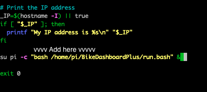

# Making this project yourself
[Back to README](/README.md)  
[How to use the Bike Dashboard](/docs/pages/usage.md)

This page is for people who are interested in making a Bike Dashboard with their own Raspberry Pi. The schematics and designs shown are what work best for me and my bike and may not work for you, so feel free to edit the code, the schematics, and the design for the case and mount. 

## Parts needed

These are the parts you may need to buy to make this project. Depending on how you want to make this project, you can leave out some parts or get other parts. These are just the parts I got.

### Electronics
- [Raspberry Pi Zero W](https://www.amazon.com/Vilros-Raspberry-Starter-Power-Premium/dp/B0748MPQT4/ref=pd_lpo_1?pd_rd_i=B0748MPQT4&psc=1) (This links to a kit)
  - [MicroUSB to USB adapter](https://www.amazon.com/Ksmile%C2%AE-Female-Adapter-SamSung-tablets/dp/B01C6032G0/ref=asc_df_B01C6032G0/?tag=hyprod-20&linkCode=df0&hvadid=309833041189&hvpos=&hvnetw=g&hvrand=12260953306372108187&hvpone=&hvptwo=&hvqmt=&hvdev=c&hvdvcmdl=&hvlocint=&hvlocphy=9031971&hvtargid=pla-567647287320&psc=1)
- [Arduino Nano](https://www.amazon.com/REXQualis-Board-ATmega328P-Compatible-Arduino/dp/B07WK4VG58/ref=sr_1_2_sspa?dchild=1&keywords=arduino+nano&qid=1628565123&s=electronics&sr=1-2-spons&psc=1&spLa=ZW5jcnlwdGVkUXVhbGlmaWVyPUExUk9PQUJCTUtHRlpPJmVuY3J5cHRlZElkPUEwNTgzMzY5VlM4M01ISUNKTjBTJmVuY3J5cHRlZEFkSWQ9QTA3MjczMzU3RU1RTjFCUlgzQUomd2lkZ2V0TmFtZT1zcF9hdGYmYWN0aW9uPWNsaWNrUmVkaXJlY3QmZG9Ob3RMb2dDbGljaz10cnVl)
- [Neo-6M GPS module](https://www.amazon.com/Navigation-Positioning-Microcontroller-Compatible-Sensitivity/dp/B084MK8BS2/ref=sr_1_2_sspa?dchild=1&keywords=neo+6m&qid=1628279273&s=electronics&sr=1-2-spons&psc=1&spLa=ZW5jcnlwdGVkUXVhbGlmaWVyPUEzNlhLQTRHM01TMFFQJmVuY3J5cHRlZElkPUEwMzk5NzU3MlkzOFhXQVYxSzM5NSZlbmNyeXB0ZWRBZElkPUEwMjMwNDg0M0I3Mzc3QUFHOVlNRSZ3aWRnZXROYW1lPXNwX2F0ZiZhY3Rpb249Y2xpY2tSZWRpcmVjdCZkb05vdExvZ0NsaWNrPXRydWU=)
- [128x64 SSD1306 OLED display](https://www.amazon.com/UCTRONICS-SSD1306-Self-Luminous-Display-Raspberry/dp/B072Q2X2LL/ref=sr_1_4?dchild=1&keywords=oled+display&qid=1628279332&s=electronics&sr=1-4)
- [22 LEDs: 20 white, 1 red, 1 green](https://www.amazon.com/eBoot-Pieces-Emitting-Diodes-Assorted/dp/B06XPV4CSH/ref=asc_df_B06XPV4CSH/?tag=hyprod-20&linkCode=df0&hvadid=167146990738&hvpos=&hvnetw=g&hvrand=16456105429600568208&hvpone=&hvptwo=&hvqmt=&hvdev=c&hvdvcmdl=&hvlocint=&hvlocphy=9031971&hvtargid=pla-369941417757&psc=1)
- [Tactile pushbutton switch](https://www.amazon.com/OCR-180PcsTactile-Momentary-Switches-Assortment/dp/B01MRP025V/ref=sr_1_5?dchild=1&keywords=button+arduino&qid=1628279410&sr=8-5)
- [Breadboard](https://www.amazon.com/Breadboards-Solderless-Breadboard-Distribution-Connecting/dp/B07DL13RZH/ref=sr_1_1_sspa?dchild=1&keywords=breadboard&qid=1628279437&sr=8-1-spons&psc=1&spLa=ZW5jcnlwdGVkUXVhbGlmaWVyPUFTNlg2UERYMkY4SkcmZW5jcnlwdGVkSWQ9QTA1OTQ5OTMyNk5ISVQ3S0NCOEU3JmVuY3J5cHRlZEFkSWQ9QTA3ODI1MDYzOTdGQVNNODVCT0g1JndpZGdldE5hbWU9c3BfYXRmJmFjdGlvbj1jbGlja1JlZGlyZWN0JmRvTm90TG9nQ2xpY2s9dHJ1ZQ==)  (if you don't want to solder, recommended for testing before soldering)
- [Perfboard](https://www.amazon.com/ELEGOO-Prototype-Soldering-Compatible-Arduino/dp/B072Z7Y19F/ref=sr_1_1_sspa?dchild=1&keywords=perfboard&qid=1628279449&sr=8-1-spons&psc=1&spLa=ZW5jcnlwdGVkUXVhbGlmaWVyPUEzU1pPTjY3VlVKTFpFJmVuY3J5cHRlZElkPUEwNzk0ODYwMVZBSFY4M0RMSlM0JmVuY3J5cHRlZEFkSWQ9QTA0MzUzMTMxRVlZU1AyWjQ3R0wmd2lkZ2V0TmFtZT1zcF9hdGYmYWN0aW9uPWNsaWNrUmVkaXJlY3QmZG9Ob3RMb2dDbGljaz10cnVl) or [stripboard](https://www.amazon.com/YUNGUI-Prototype-perfboard-Sording-Electronic/dp/B088GSJM7G/ref=sr_1_3?dchild=1&keywords=stripboard&qid=1628279465&sr=8-3) (for a more permanent build)
- [Jumper wires](https://www.amazon.com/EDGELEC-Breadboard-Optional-Assorted-Multicolored/dp/B07GD2BWPY/ref=sr_1_1_sspa?dchild=1&keywords=jumper+wires&qid=1628279487&sr=8-1-spons&psc=1&spLa=ZW5jcnlwdGVkUXVhbGlmaWVyPUE2RTJDN0I3NUxUMUUmZW5jcnlwdGVkSWQ9QTA4MDEwNDcyUEExWTVZTlQzNlRMJmVuY3J5cHRlZEFkSWQ9QTA5NDU0MzYxSkE3VExKQkZEQUxaJndpZGdldE5hbWU9c3BfYXRmJmFjdGlvbj1jbGlja1JlZGlyZWN0JmRvTm90TG9nQ2xpY2s9dHJ1ZQ==)
- [Micro USB cable](https://www.amazon.com/AmazonBasics-Male-Micro-Cable-Black/dp/B0711PVX6Z/ref=asc_df_B0711PVX6Z/?tag=hyprod-20&linkCode=df0&hvadid=198093101467&hvpos=&hvnetw=g&hvrand=12260953306372108187&hvpone=&hvptwo=&hvqmt=&hvdev=c&hvdvcmdl=&hvlocint=&hvlocphy=9031971&hvtargid=pla-359221356227&psc=1) (for power)
- [2 10k ohm resistors and 2 220-330 ohm resistors](https://www.amazon.com/Resistor-Assortment-Kit-Thermistor-Photoresistor/dp/B0792M83JH/ref=sr_1_1_sspa?dchild=1&keywords=resistor+kit&qid=1628279500&sr=8-1-spons&psc=1&spLa=ZW5jcnlwdGVkUXVhbGlmaWVyPUFLOEZWQjNZQ1Q3RTYmZW5jcnlwdGVkSWQ9QTAzNjU4NTEyTlJXQllLU0syRkMmZW5jcnlwdGVkQWRJZD1BMDkxNjMwMExJRk9NUzE0MzFSMCZ3aWRnZXROYW1lPXNwX2F0ZiZhY3Rpb249Y2xpY2tSZWRpcmVjdCZkb05vdExvZ0NsaWNrPXRydWU=)

### Case and mount
The materials depend on how you want to make this project. For example, if you wanted to 3D print the case and the mount to the bike, then you would need a 3D printer and filament. I used:
- [Basswood](https://www.amazon.com/Basswood-Sheets-Unfinished-Plywood-Crafts/dp/B08VN3HXDT/ref=sr_1_7?dchild=1&keywords=basswood&qid=1628279730&sr=8-7) (I got a much harder and thicker type of wood. This wood should be easily cuttable with a razor blade or a x-acto knife.)
- [X-acto knife](https://www.amazon.com/X-Acto-XZ3601-X-ACTO-Knife-Safety/dp/B005KRSWM6/ref=sr_1_5?crid=2TNSLQ787JYN7&dchild=1&keywords=xacto+knife&qid=1628279798&sprefix=x+acto+%2Caps%2C251&sr=8-5)
- [Hand saw](https://www.amazon.com/CRAFTSMAN-Hand-12-Inch-Hacksaw-CMHT20138/dp/B07R92S9YZ/ref=sr_1_5?dchild=1&keywords=hand+saw&qid=1628279935&sr=8-5) 
- [Hot glue, hot glue gun](https://www.amazon.com/Gluerious-Sticks-Crafts-School-Repairs/dp/B08FTHWC94/ref=sr_1_1_sspa?dchild=1&keywords=hot+glue+gun&qid=1628279885&sr=8-1-spons&psc=1&spLa=ZW5jcnlwdGVkUXVhbGlmaWVyPUExSFZGUlRKQUxHWlVXJmVuY3J5cHRlZElkPUEwMjA1OTM4MlRZVjlaWUtVTFlHUCZlbmNyeXB0ZWRBZElkPUEwNjM3NDc4MVRMOTZFOTNaRFBTSiZ3aWRnZXROYW1lPXNwX2F0ZiZhY3Rpb249Y2xpY2tSZWRpcmVjdCZkb05vdExvZ0NsaWNrPXRydWU=)
- [Gorilla glue](https://www.amazon.com/Gorilla-Original-Waterproof-Polyurethane-Bottle/dp/B0000223UV/ref=sr_1_2_sspa?dchild=1&keywords=gorilla+glue&qid=1628279996&sr=8-2-spons&psc=1&spLa=ZW5jcnlwdGVkUXVhbGlmaWVyPUEyVFhHTzVWVE9VS0VEJmVuY3J5cHRlZElkPUEwNDUzODU1OTNHMlNCUVhNQlk2JmVuY3J5cHRlZEFkSWQ9QTA2MzIzMTJOMVFUQzZLSVdYWlgmd2lkZ2V0TmFtZT1zcF9hdGYmYWN0aW9uPWNsaWNrUmVkaXJlY3QmZG9Ob3RMb2dDbGljaz10cnVl)

## Schematic

Actual schematic


A more intuitive schematic

If you do not feel like soldering, you can use a breadboard.

I did not design a PCB for this schematic. Instead, I soldered all of these components onto a prototype PCB, which was hard and time-consuming. I may design a custom PCB if I come back to this project. Also, soldering the LED panel is optional as all information displayed there will be displayed on the OLED.

## 3D Printing

More information on 3D Printing and the case/mount design can be found [here](https://github.com/jonyboi396825/BikeDashboardPlus/tree/master/hardware/models).

## Installation

There will be two steps during installation: configuring your Pi so the software will work, and installing the software. However, before that:

If you haven't installed the Raspberry Pi OS, follow the instructions below. Make sure to install "Raspberry Pi OS (32 bit)" and not any other OS as they might not come with Python, cURL, or git.
- [Setting up the Raspberry Pi](https://projects.raspberrypi.org/en/projects/raspberry-pi-setting-up)
- [Setting up the Raspberry Pi headless](https://www.raspberrypi.org/documentation/configuration/wireless/headless.md)

- Python installation if you do not have it installed
  ```
  sudo apt update
  sudo apt install python3 idle3
  ```

- cURL installation if you do not have it installed:
  ```
  sudo apt update
  sudo apt install curl
  ```

- Git installation if you do not have it installed
  ```
  sudo apt update
  sudo apt install git
  ```

### Configuring

Configuring git:
1. Type in `git config --global user.name "Your name"`
2. Type in `git config --global user.email "your@email.com"`  
Replace `"Your name"` and `"your@email.com"` with your actual name and your actual email.

Configuring the pins: 
1. Type in `sudo raspi-config`
2. Go to "Interface options" and select `I2C`, then select Yes.
3. Return to "Interface options" and select `Serial Port`. When it asks `Would you like a login shell to be accessible over serial?`, select No. It will then ask, `Would you like the serial port hardware to be enabled?`, and select Yes.
4. Click Finish.
5. Reboot the Raspberry Pi: `sudo reboot`

### Installing

1. To install BikeDashboard Plus, first run this command: 
    ```
    curl -sO https://raw.githubusercontent.com/jonyboi396825/BikeDashboardPlus/master/install.bash
    ```

    After running this, you will have to figure out the serial port of your Arduino. Type `ls -l /dev` to see all serial ports. The port for the Arduino should be `ttyUSB*` or `ttyACM*`. The best way to check which port the Arduino is located on is to plug in the Arduino, take note of the ports that are `ttyUSB*` or `ttyACM*`, then unplug the Arduino, and see which of those ports disappeared. That port would be the Arduino.

    After getting the path to the serial port (ex `/dev/ttyUSB0` or `/dev/ttyACM0`), type this command in:
    
    ```
    bash install.bash /dev/port
    ```
    Replace `/dev/port` with the actual path to the serial port. The installation process should take around 1-2 minutes on a Raspberry Pi 4 and around 8-10 minutes on a Raspberry Pi Zero.

2. Make a backup of /etc/rc.local: `sudo cp /etc/rc.local /etc/rc_backup.local`
3. Edit /etc/rc.local
- Type `sudo nano /etc/rc.local`
- Scroll down. Type in `su pi -c "bash /path/to/BikeDashboardPlus/run.bash" &` **before the** `exit 0`. You can find out the path by typing `cat ~/BikeDashboardPlus.txt`. **Make sure to add the ampersand or the Pi will not boot.** This line will make the Raspberry Pi run the program when it boots. The `su pi -c` runs the program as the `pi` user so you would be able to access the files in the program later.
- Save and exit: Press ^X (Control-X), then Y, then enter. 

    
  *Don't* add the `vvvv Add here vvvv`. That is just to show where to add the line.

4. Reboot the Pi: `sudo reboot`

From now on, the program should immediately run whenever you turn on and boot up your Raspberry Pi.

## Disabling
This prevents the program from running whenever you start up your Raspberry Pi.

1. Type `sudo nano /etc/rc.local`
2. Delete the line that you added when installing (shown in the image above).
3. Save and exit: Press ^X (Control-X), then Y, then enter.
4. Reboot the Pi: `sudo reboot`.

To re-enable it, just type that line back into `/etc/rc.local` at the same place.
    
## Uninstalling

1. Disable the program (See "Disabling")
2. `cd` into the directory you installed BikeDashboardPlus in.
- You can check by typing `cat ~/BikeDashboardPlus.txt`
3. Type `rm -rf BikeDashboardPlus` to delete the folder and all of its contents.
4. Type `rm ~/BikeDashboardPlus.txt`
5. Reboot the Pi: `sudo reboot`
