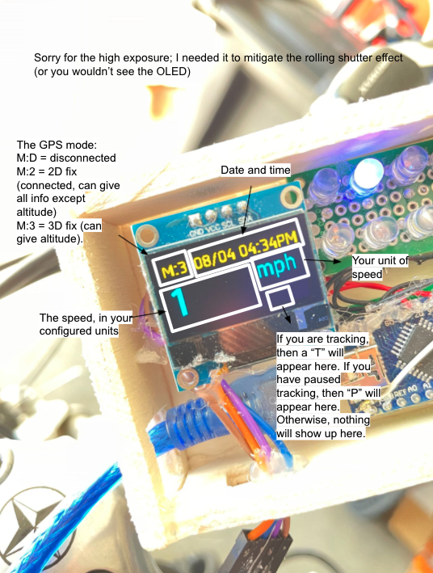

# How to use your Bike Dashboard

[Back to README](/README.md)  
If you have not installed Bike Dashboard, [go here](/docs/pages/make_yourself.md).

There are 2 modes to the Bike Dashboard: Bike mode, and server mode. Bike mode is the mode that you set when you are riding your bike. The OLED display will display time, speed, etc., and you can track your route. Server Mode sets up a server where you can configure your Bike Dashboard and where you can view the maps of your tracked routes.

To turn the Bike Dashboard on, power on your Raspberry Pi and wait 30 seconds to 1 minute to let it boot up. 

To turn it off, press button 2 on the central unit (the one wired to BCM pin 18 on the RPi).

## Bike Mode
The Bike Dashboard automatically goes into Bike Mode when it boots up. 

After displaying some setup text, the OLED will display the things you will see in Bike Mode. This diagram will show what each thing displayed on the OLED represents:

  

This is how the LEDs on the LED panel are numbered:  
  
How it works:
If the configuration "LED" is 0, then LED *n* (on the panel) will light up if you are going *n* mph, km/h, or m/s. If "LED" is set to 1, then LED *n/2* will light up if you are going *n* mph, km/h, or m/s.

To start tracking, press the button wired to pin D4 on the Arduino Nano. The green LED on the Arduino will light up and a "T" will show up on the bottom right of the OLED display to indicate that you are currently tracking. **Note that tracking is not possible if you are disconnected** i.e. the red LED is on or it says "M:D" on the OLED.

Once you have started tracking, it will immediately write to a new track file. If you have started this by accident, don't worry, you can delete this later. 

To pause tracking, press the button wired to pin D5 on the Arduino. Indicators that you have paused are the green LED blinking instead of staying constantly on and the OLED display a "P" on the bottom right corner. To resume, press the same button. 

To end tracking, press the same button as the one you pressed when you started tracking. The green LED will turn off and there should be nothing displayed on the bottom right corner of the OLED. 

### What if my program is always quitting?

If the program is quitting before entering bike mode, and both your OLED and Arduino are connected, it may be that the port to the Arduino in the `port` file is wrong. 

If this happens, `ssh` into your Pi, then [go here](/docs/pages/make_yourself.md) and go under "Installation" to find out which serial port your Arduino is connected to. After that, type in 
```
nano raspberrypi/port
```
then change the port in the file to the new port of the Arduino. Then save and close the file (press ^X, then Y, then enter).

### What if my Arduino or OLED got disconnected?

If your Arduino is disconnected, the OLED should display something beginning with "Oh no!". 

Reconnect your Arduino, wait ~5 seconds, then press button 1 (the one wired to BCM pin 17 on the RPi). If it still displays "Oh no!", then try to disconnect the Arduino and reconnect it again, wait ~15 seconds, then press button 1. If the problem persists, then try to shut it down and start it up again, making sure the Arduino is connected. If it is **still** happening, then go to "What if my program is always quitting?".

If your OLED got disconnected, it should be a blank screen, or the time on the OLED does not match the actual time, and the TX and RX LEDs on the Arduino are not rapidly flashing. 

Try pressing button 1 to restart your OLED. If it is quickly disconnects again, then try unplugging your OLED and plugging it in again. If the problem still persists, then restart your Pi making sure the OLED is connected.

## Server Mode

To get into server mode from bike mode, you need to shut it off and turn it back on again. To do this, press button 2 on the central unit (the one wired to BCM pin 18 on the RPi).

When the "Setup" screen comes on the OLED, press and hold button 1 on the central unit (the one wired to BCM pin 17 on the RPi). When the "Server mode" screen comes on, you are in server mode, and the Raspberry Pi is hosting a website on your network. Note that if there is no internet connection, server mode would fail and it would go into Bike Mode.

Go to the website shown on the OLED. It should be `http://{your.pi.IP}:7123`.

On the home page, you should see this (the version number will be different):   
  
There are 3 options: the configuration page, the map page, and the combining page. I will go through what each one does.

### Configuration
The configuration page should look like this:


It is a table showing all the configurations, what they mean, and what value you have to enter. You have to enter that value into the text box on the right column of the table. 

For the time zone, you should copy and paste from the list in the link rather than typing it out as it is case sensitive and you have to type it out exactly like it is in the table.

At the end, click submit.

### Map
You should not be able to see anything on the map page if you do not have any track files. If you do, the link name will be something like:
```
Started tracking at: <date> <time> UTC
```
When you click on it, it should look like this:

(Don't worry, I don't live here.)

If you see a message advising you to delete the file, then there was some error writing/reading the tracking file and you should delete it.

The data should not be as precise as shown above as that was copied from Google Maps.

On the map, you should be able to see your route. There are a start marker, an end marker, and multiple pause/resume markers depending on where you paused.

On the bottom of the map, you should see how far you have travelled depending on your "UNT" configuration.
- If "UNT" is 0 (mph), then it shows in miles and feet
- If "UNT" is 1 (km/h) or 2 (m/s), then it shows in kilometers and meters

If you accidentally started tracking and you want to delete the file, press "Delete this file" at the bottom of the page.

### Combining

If your GPS got disconnected whilst tracking, and you had to restart the tracking, leading to 2 or more separate tracking files, you can combine them in the "combining" page. However, on the map, it will indicate that you paused at the end of one tracking file and resumed at the start of the next instead of drawing one continuous line between the two.

**Note that you cannot separate files after combining them.**

Click the checkboxes in the order you want to combine the files. You will see the order of the file numbers below so you can confirm your choices. 

Click submit to combine the files.

### Shutting down

Press the button wired to BCM pin 18 to shut the Pi down.

